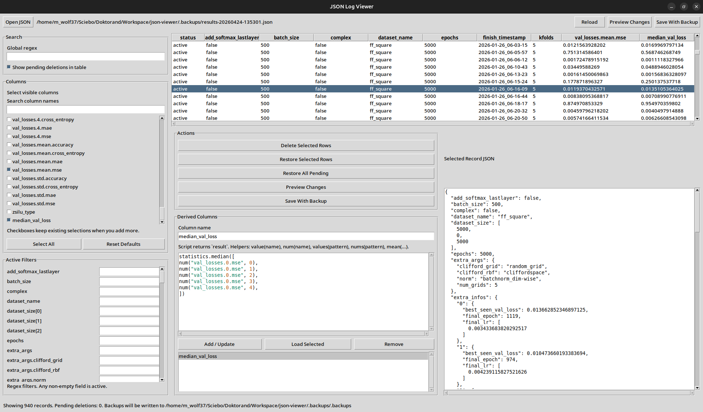

# JSON Log Viewer

> Warning
> This project was vibe-coded. Treat it as a practical utility, not a hardened production application.
> Review behavior carefully before using it on important data.

~~Reliable~~ Vibe-coded Python GUI for inspecting and pruning JSON experiment logs.

## Features

- Opens arbitrary JSON files and automatically detects the main editable record list
- Flattens nested dictionaries and lists into path-based columns like `train_losses.mean.mse`
- Lets you choose visible columns using checkbox lists and a column-name search box
- Shows all column filters in one scrollable panel; any non-empty filter is active automatically
- Uses regex matching for global search and per-column filters
- Supports temporary derived columns created from Python expressions or scripts in the GUI
  - temporary columns are never written to json file, they only exist in the GUI
  - can be defined by scripting in python with limited capabilities (see section **Derived Column Helpers**)
  - Provides basic syntax highlighting in the derived-column script editor
- Supports ascending and descending sorting by clicking table headers
- Supports global text search and per-column substring filters
- Lets you select rows and mark them for deletion before writing
- Can show pending deletions in the table so you can restore specific rows before saving
- Shows pending removals and a unified diff before saving
- Shows a dedicated deleted-rows table in the preview window
- Always creates a timestamped backup in `.backups/` next to the source file before writing



## Run

Install the package locally:

```bash
pip install -e .
```

And run it with an optional path to a json file:

```bash
json-log-viewer [results.json]
```

## Notes

- Filtering is case-insensitive substring matching.
- Saving currently writes deletion-only changes. The app does not edit field values.
- If the JSON file contains several nested lists, the viewer edits the largest detected list and preserves the rest of the document structure on save.

## Derived Column Helpers

The `Derived Columns` box lets you create temporary GUI-only columns using a Python expression or a small script that assigns to a variable `result` or simply evaluates to one single number / value (e.g. float, String, ...).

These derived columns are never written back to the JSON file.

### Available Helpers

- `record`
  Dictionary containing the current row's available column values as strings.

- `value(name, default="")`
  Returns the value of one column by exact name.

  Example:

  ```python
  value("dataset_name")
  ```

- `values(pattern)`
  Returns a list of string values for all columns matching a wildcard pattern.

  Example:

  ```python
  values("extra_infos.*.best_seen_val_loss")
  ```

- `num(name, default=None)`
  Returns one column converted to `float`.

  Example:

  ```python
  num("train_losses.mean.mse")
  ```

- `nums(pattern)`
  Returns a list of matching column values converted to `float`.

  Example:

  ```python
  nums("extra_infos.*.best_seen_val_loss")
  ```

- `mean(list, default=None)`
  Returns the arithmetic mean of a numeric list. If the list is empty, returns `default`.

  Example:

  ```python
  mean(nums("extra_infos.*.best_seen_val_loss"))
  ```

- `math`
  Python's `math` module.

- `statistics`
  Python's `statistics` module.

### Examples

Mean of all best validation losses across folds:

```python
result = mean(nums("extra_infos.*.best_seen_val_loss"))
```

Create a label from existing values:

```python
result = f"{value('dataset_name')} | {value('model_name')}"
```

Use an expression directly instead of assigning to `result`:

```python
mean(nums("extra_infos.*.best_seen_val_loss"))
```
